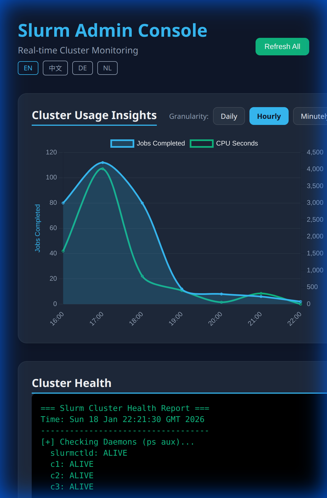
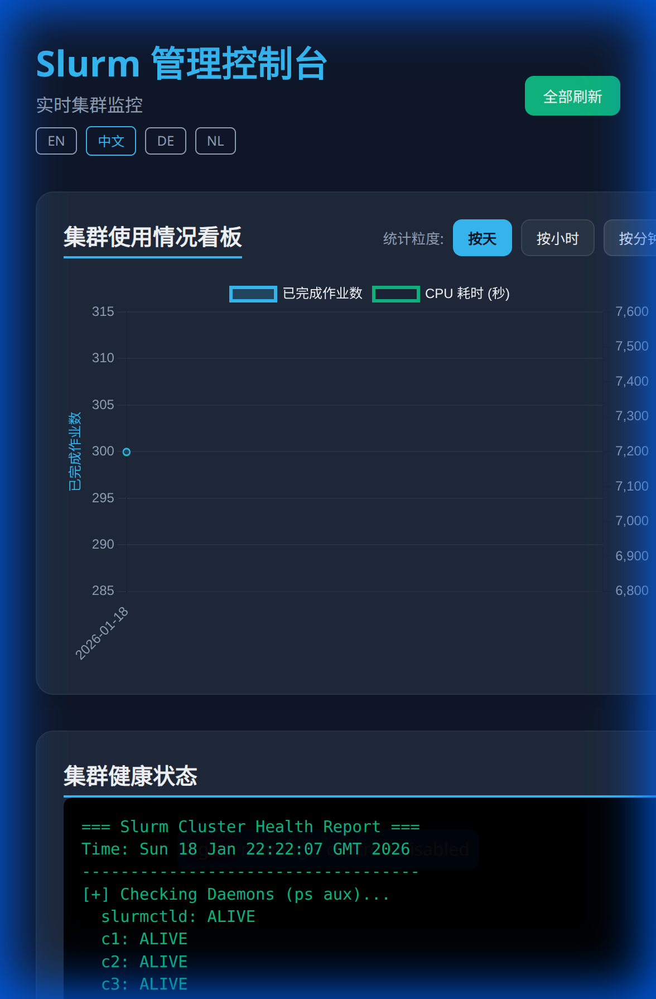
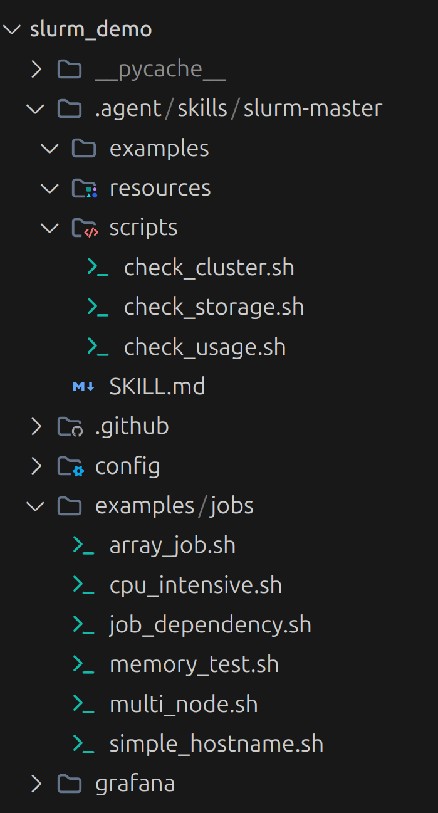

# Slurm Admin Dashboard (Flask)

A real-time, multi-language monitoring dashboard for the Slurm Docker Cluster. Built with Flask and Chart.js, it provides administrators with a high-level overview of cluster health, storage usage, and job accounting.

## 🚀 Overview

The Slurm Admin Dashboard bridges the gap between CLI-based Slurm management and visual monitoring. It captures live data from the cluster using Slurm's accounting and management tools and displays it in an intuitive, responsive web interface.

### Key Features

- **Real-time Monitoring**: Instant updates on cluster health and node status.
- **Visual Analytics**: Interactive time-series charts for job completion and CPU consumption using Chart.js.
- **Multi-language Support**: Full UI localization for **English**, **Chinese (简体中文)**, **German (Deutsch)**, and **Dutch (Nederlands)**.
- **Flexible Granularity**: Analyze cluster usage patterns with **Daily**, **Hourly**, and **Minutely** views.
- **Resource Insights**:
  - **Cluster Health**: Summary of partition and node availability.
  - **Storage Status**: Real-time disk usage tracking across all cluster components.
  - **User Activity**: Leaderboard ranking users by CPU time and job count.

## 📸 Screenshots

### English - Hourly View


### German - Minutely View


### Chinese - Daily View



### Project Structure - Example Jobs


## 🛠️ Installation & Usage

### Prerequisites

- The Slurm Docker Cluster must be running (`make up`).
- Python 3.x with Flask installed.

### Setup

1. **Install Dependencies**:
   ```bash
   pip install flask
   ```

2. **Run the Dashboard**:
   ```bash
   python3 app.py
   ```

3. **Access the Web UI**:
   Open your browser and navigate to `http://localhost:5000`.

## 📂 Project Structure

- `app.py`: The core Flask application handling data retrieval and template rendering.
- `.agent/skills/slurm-master/scripts/`: Backend scripts used to fetch Slurm data (health, storage, usage).
- `templates`: (Embedded in `app.py`) Modern CSS-in-JS styled HTML template using Inter font and dark mode aesthetics.

## 📈 Data Sources

The dashboard aggregates data using the following Slurm commands:
- `sinfo`: For cluster health and partition state.
- `df -h`: For storage monitoring across containers.
- `sacct`: For historical job data and time-series generation.
- Custom parsing logic for user activity rankings.

---
*Created for the Slurm Docker Cluster project.*
